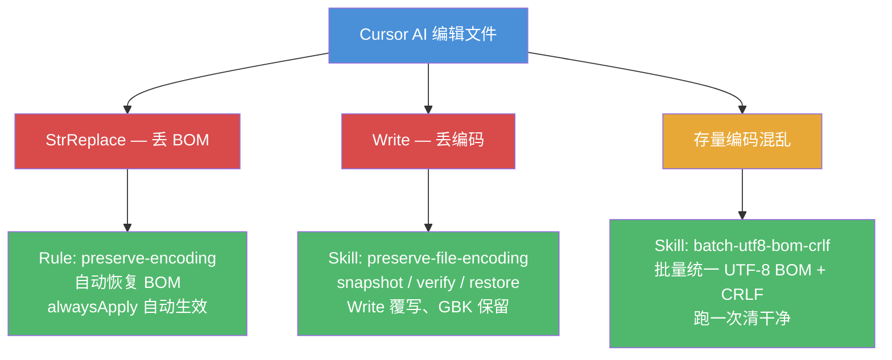

# cursor-encoding-safeguard

Cursor AI 编辑文件时的编码安全防护工具集。解决 Cursor StrReplace/Write 丢失 UTF-8 BOM、篡改文件编码和换行符的问题。

## 解决什么问题

Cursor 的编辑工具（StrReplace / Write）在写回文件时会**剥离 UTF-8 BOM**，且无法通过 AI prompt 阻止。对于要求 UTF-8 BOM + CRLF 的 C++/MSVC 项目，丢 BOM 直接导致编译报错（`C4819` / `C2001`）。

本工具集通过 **1 Rule + 2 Skills** 形成闭环防护：



| 工具 | 类型 | 做什么 | 何时用 |
|---|---|---|---|
| `preserve-encoding` | Rule | 强制 AI 每次编辑 .cpp/.h 后恢复 BOM | 日常防护，`alwaysApply` 自动生效 |
| `preserve-file-encoding` | Skill | snapshot / verify / restore 编码守卫 | Write 覆写、GBK 保留、批量验证 |
| `batch-utf8-bom-crlf` | Skill | 批量统一编码为 UTF-8 BOM + CRLF | 存量治理，跑一次清干净 |

## 安装

### 方式一：自动安装（推荐）

```bash
# 克隆仓库
git clone https://github.com/shaotianlu1995/cursor-encoding-safeguard.git
cd cursor-encoding-safeguard

# 安装到当前项目
python install.py /path/to/your/project

# 安装到全局（所有项目生效）
python install.py --global
```

### 方式二：手动安装

将文件复制到项目的 `.cursor/` 目录：

```
your-project/
└── .cursor/
    ├── rules/
    │   └── preserve-encoding.mdc          ← 复制 rules/preserve-encoding.mdc
    └── skills/
        ├── batch-utf8-bom-crlf/
        │   ├── SKILL.md                   ← 复制 skills/batch-utf8-bom-crlf/SKILL.md
        │   └── scripts/
        │       └── convert_to_utf8_bom_crlf.py
        └── preserve-file-encoding/
            ├── SKILL.md                   ← 复制 skills/preserve-file-encoding/SKILL.md
            └── scripts/
                └── encoding_guard.py
```

## 使用方式

### Rule: preserve-encoding（自动生效）

安装后无需任何操作。Rule 设置了 `alwaysApply: true`，Cursor AI 每次编辑 `.cpp`/`.h` 文件后会自动运行 BOM 恢复脚本。

### Skill: batch-utf8-bom-crlf（按需调用）

对 Cursor AI 说：

> "把 src 目录下的源码统一转为 UTF-8 BOM + CRLF"

AI 会调用此 Skill，执行批量转换脚本。也可手动运行：

```bash
# 转换整个目录
python .cursor/skills/batch-utf8-bom-crlf/scripts/convert_to_utf8_bom_crlf.py src

# 仅转换 .cpp 和 .h
python .cursor/skills/batch-utf8-bom-crlf/scripts/convert_to_utf8_bom_crlf.py src .cpp .h

# 预览模式（不实际写入）
python .cursor/skills/batch-utf8-bom-crlf/scripts/convert_to_utf8_bom_crlf.py src --dry-run

# 单个文件
python .cursor/skills/batch-utf8-bom-crlf/scripts/convert_to_utf8_bom_crlf.py -f path/to/file.cpp
```

### Skill: preserve-file-encoding（按需调用）

```bash
# 1. 记录编码快照
python .cursor/skills/preserve-file-encoding/scripts/encoding_guard.py snapshot src

# 2. (进行文件编辑操作...)

# 3. 验证编码是否改变
python .cursor/skills/preserve-file-encoding/scripts/encoding_guard.py verify src

# 4. 如有变化，还原
python .cursor/skills/preserve-file-encoding/scripts/encoding_guard.py restore src
```

## 适用场景

- **MSVC C++ 项目**：要求 UTF-8 BOM 才能正确编译中文字符
- **混合编码项目**：GBK、无 BOM UTF-8、各种换行符混杂
- **任何使用 Cursor AI 编辑源码的场景**：防止 AI 工具破坏文件编码

## 依赖

- Python 3.6+（仅用标准库，无第三方依赖）

## 许可证

MIT
