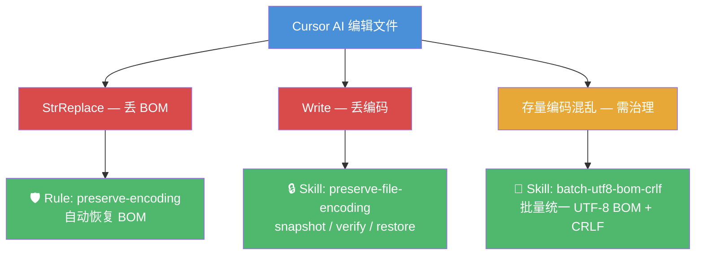
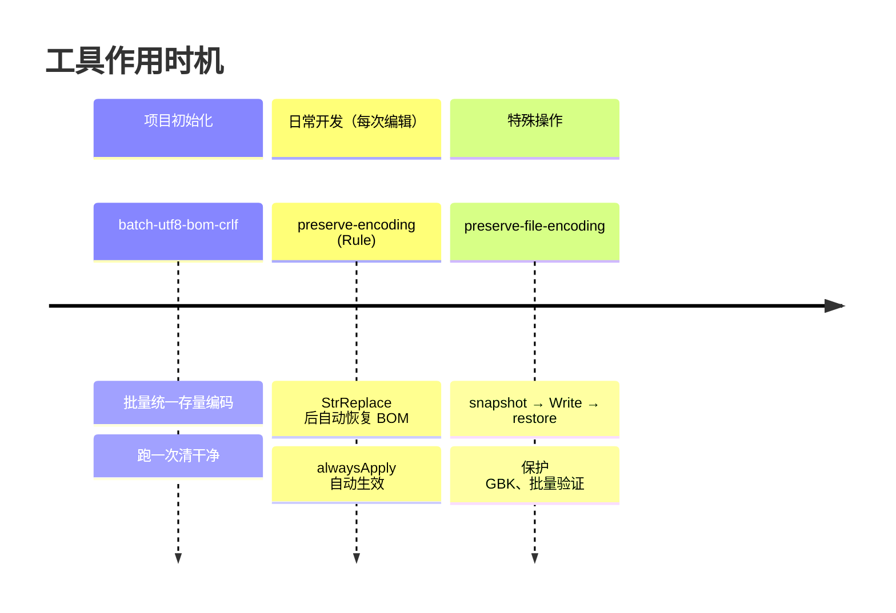
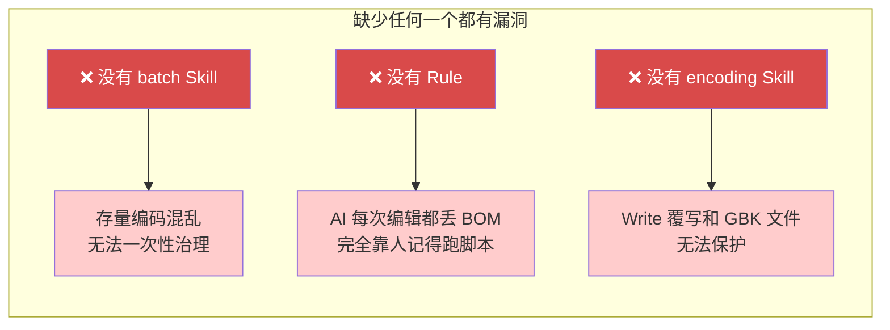

# AI 编码安全体系（1 Rule + 2 Skills）

## 问题背景

AI 控制不了编辑器底层的二进制行为。Cursor 编辑工具写回文件时会丢失 UTF-8 BOM，AI 无法阻止。许多 MSVC C++ 项目要求所有源码 UTF-8 BOM + CRLF，丢 BOM 直接导致编译报错。

加上项目历史积累的编码混乱（GBK、无 BOM UTF-8、LF/CRLF 混杂），需要一套工具体系来保障编码安全。

## 为什么需要脚本托底

**核心思路**：AI 管不了二进制层的事，全部用脚本托底。Rule 告诉 AI 何时调脚本，Skill 提供脚本本身。

## 三工具闭环

## 各工具说明

| 工具 | 类型 | 做什么 | 何时用 |
|---|---|---|---|
| `batch-utf8-bom-crlf` | Skill | 批量统一编码为 UTF-8 BOM + CRLF | 存量治理，跑一次清干净 |
| `preserve-encoding` | Rule | 强制 AI 每次编辑后恢复 BOM | 日常防护，自动生效 |
| `preserve-file-encoding` | Skill | snapshot/verify/restore 编码守卫 | 兜底：Write 覆写、GBK 保留、批量验证 |

## 作用时机

## 为什么三个都需要？

